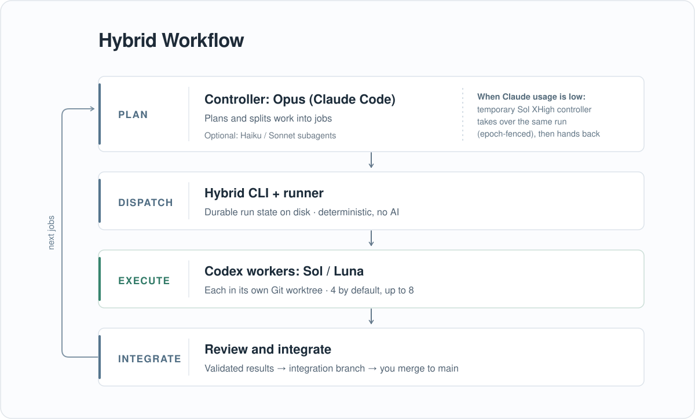
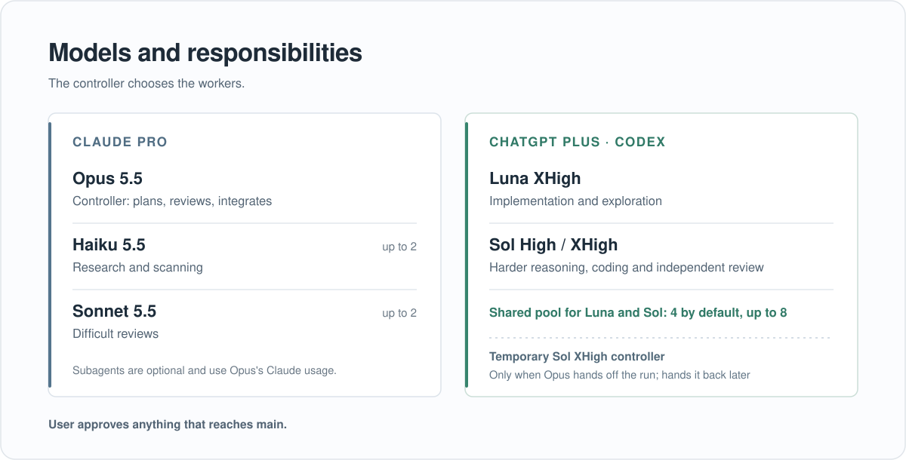

# Hybrid Workflow

**Use Claude Pro and ChatGPT Plus together in one engineering workflow.**

Claude Code (Opus) leads: it plans work, delegates bounded jobs, reviews results and integrates
accepted changes. Native Codex CLI workers (Sol and Luna) handle parallel implementation,
exploration and review in isolated Git worktrees. Opus can also use Haiku and Sonnet subagents
for short Claude-side tasks.

When Claude usage runs low, Opus can hand an active run to a **temporary, sandboxed Sol XHigh
controller**. Sol continues with the same jobs, state and integration branch; Opus can take
ownership back later. The runner is a deterministic process manager, never an AI orchestrator.

Both harnesses use their own subscription sign-in, with no model API keys or per-token API
billing required for normal use. Claude Pro and ChatGPT Plus have separate usage limits;
Hybrid coordinates them without combining or bypassing those limits.

Windows only. MIT licensed.

## Workflow architecture



Opus plans and delegates jobs through Hybrid. The runner launches Codex workers in isolated Git
worktrees, captures and validates their results, and returns them to Opus for review and
integration. You approve anything that reaches `main`. When Claude's quota is running low,
Opus can hand the **same run** to a sandboxed Sol XHigh controller and take it back later.

## Model topology



The limits shown are **ceilings, not targets**. Opus selects the workers required for each
task; Claude subagents are optional. See [Choosing agents and concurrency](#choosing-agents-and-concurrency)
and [Controller handoff](#controller-handoff-opus-to-sol-and-back).

---

## Quick start

### One-time setup

1. Install Node.js 22.12 or newer and Git for Windows.
2. Install Claude Code and sign in with your Claude subscription.
3. Install the Codex CLI and sign in with your ChatGPT subscription. Hybrid looks for
   `%LOCALAPPDATA%\Programs\OpenAI\Codex\bin\codex.exe` (the standalone Windows install); set
   `codex_exe` in `config.json` to use another location. Workers run in Codex's elevated Windows
   sandbox, which uses two local accounts (`CodexSandboxOffline`, `CodexSandboxOnline`) that
   Codex creates with its own setup helper. Creating local accounts requires administrator
   rights; how Codex obtains them on a fresh machine has not been tested. `codex doctor` reports
   the sandbox backend Codex will use.
4. Clone this repository and check the machine:
   ```bash
   git clone https://github.com/iamnomankazi/hybrid-workflow.git
   cd hybrid-workflow
   node bin/hybrid.mjs doctor
   ```
   `doctor` checks Node, Git, Codex (and its version), the worktree root, the shared browser and
   whether Codex's sandbox accounts can read your Codex sign-in tokens (`auth.json`).
5. If `doctor` warns about `credentials`: workers have network access, so block the sandbox
   accounts from reading the files directly inside `%USERPROFILE%\.codex`, including `auth.json`.
   The deny is inherited by every new `auth.json` Codex writes:
   ```powershell
   icacls "$env:USERPROFILE\.codex" /deny "CodexSandboxUsers:(OI)(IO)(NP)(RD)"
   ```
   To undo it: `icacls "$env:USERPROFILE\.codex" /remove:d CodexSandboxUsers`
6. Optional, for browser use: install a shared Playwright that the sandbox accounts can read.
   Hybrid does not install it for you.
   ```powershell
   npm install --prefix C:\hw\ms-playwright playwright
   $env:PLAYWRIGHT_BROWSERS_PATH = 'C:\hw\ms-playwright\browsers'
   C:\hw\ms-playwright\node_modules\.bin\playwright.cmd install chromium
   ```
   Run `doctor` again; the `browser` check should report the install.

### Running it

Run `npm link` once in the checkout so the `hybrid` command is on your `PATH` (or tell Claude to
use `node <checkout>\bin\hybrid.mjs` instead). Then open Claude Code in any folder and ask it to
read and follow [docs/ORCHESTRATION.md](docs/ORCHESTRATION.md), giving the full path into your
Hybrid checkout (for example `C:\src\hybrid-workflow\docs\ORCHESTRATION.md`). That document is
the contract Opus follows: how to start a run, write capsules, wait, review and integrate. Then
give it a goal. Under the hood it runs commands like these:

```bash
node bin/hybrid.mjs repo add myrepo C:\path\to\repo
node bin/hybrid.mjs run start --repo myrepo --goal "Refactor the auth module"   # prints run_id and epoch
node bin/hybrid.mjs submit job.json --epoch 1
node bin/hybrid.mjs wait --timeout 50m
node bin/hybrid.mjs result j001
```

A job is a small spec plus a capsule (the worker's full instructions):

```json
{
  "title": "Refactor token refresh",
  "preset": "luna-xhigh-impl",
  "capsule_file": "capsules/token-refresh.md",
  "write_scope": ["src/auth/", "test/auth/"]
}
```

The capsule states the goal, context, constraints, acceptance criteria and verification
commands. See [docs/CLI.md](docs/CLI.md) for all commands and the full spec format.

State lives in `%LOCALAPPDATA%\HybridWorkflow`; worktrees in `%SystemDrive%\hw\wt`. Both are
configurable.

## How a run works

1. **Start.** `run start` pins the repository commit, configuration and Codex version, records a
   fingerprint of any user-level Codex instructions, and makes the calling session the owner
   (epoch 1).
2. **Decompose.** Opus splits the goal into bounded jobs, each with a capsule, a preset (model,
   reasoning effort, sandbox) and a write scope.
3. **Execute.** The runner gives each job its own git worktree and launches `codex exec` under a
   small detached job host. Four workers run at once by default; `run start --concurrency`
   allows up to eight.
4. **Record.** Process identity, session id, events, observed model configuration, exit status
   and the full change set are written to disk.
5. **Validate.** At the end, Hybrid captures the change set itself (a temporary git index:
   untracked, binary and deleted files included) and checks it against the write scope and
   protected paths (`.git`, git hooks, `.github/workflows`, `AGENTS.md`, `CLAUDE.md`, `.claude/`,
   `.codex/`, …), symlinks, gitlinks and NTFS junctions. The verdict is `clean`, `violations`,
   `empty` or `capture_failed`; only `clean` patches may be integrated.
6. **Review and integrate.** The current controller reads results and applies clean patches to
   an integration branch (`hybrid/<run_id>`) with git hooks disabled. You decide what gets merged.

## Choosing agents and concurrency

Each run starts with a limit of **4 concurrent Codex workers**. Use
`run start --concurrency 8` to allow up to **8**, shared across Sol and Luna presets.
These are ceilings, not targets: Opus chooses how many jobs to submit and which preset fits each
job. Use higher concurrency for independent, lighter work; use fewer workers for parallel builds,
full test suites or browser tasks on machines with limited CPU and RAM.

| Agent | Typical role | Capacity |
| --- | --- | --- |
| Opus (Claude Code) | Primary planning, decisions and integration | One run controller |
| Codex Luna XHigh (`luna-xhigh-impl`) | Implementation and exploration | Shares up to 8 Codex slots |
| Codex Sol High / XHigh (`sol-high-impl`, `sol-xhigh-impl`) | Reasoning-heavy implementation | Same 8 slots |
| Codex Sol High (`sol-high-review`) | Default independent review | Same 8 slots |
| Claude Haiku 5.5 | Short research, scanning and first-pass checks | Up to 2 subagents |
| Claude Sonnet 5.5 | Difficult reviews and capsule drafting, when useful | Up to 2 subagents |

Haiku and Sonnet subagents use Claude Code's native Agent tool, **not** Hybrid worker slots.
They are read-only or work in their own isolated worktrees, never in the main checkout or
integration worktree. They share Opus's Claude Pro allowance and must finish before a controller handoff. The
two-per-model limits are orchestration rules, not a separate scheduler. Eight Codex workers
were smoke-tested concurrently with mostly idle tasks; heavy-workload throughput depends on
the machine and the available ChatGPT usage window.

## Controller handoff: Opus to Sol and back

If substantial work remains as Claude's usage window runs low, Opus can deliberately hand
control to **GPT-6.1 Sol XHigh** instead of leaving the run idle. At a clean boundary, it
records the current decisions, integration branch and exact next action in `plan.md`, then runs:

```bash
hybrid controller start --epoch N --json
```

Hybrid launches a separate, sandboxed Sol controller and keeps the existing runner available
through a host running as the Windows user. Sol reads `plan.md` and the run state, calls
`hybrid takeover` to obtain the next epoch, and continues using the same CLI, jobs and
integration worktree. This controller is separate from the ordinary restricted workers;
its writable paths are limited to the run, the repository's Git directory and designated
integration worktrees. It must never merge to `main` or push; those decisions stay with you.

When Claude becomes available, Opus reads `plan.md`, `hybrid status`, results and Git state
**from disk**, then calls `hybrid takeover` (without `--epoch`). The previous epoch is fenced
so the old controller cannot keep mutating the run. The handoff requires a clean checkpoint;
there is no automatic quota detector, second run or parallel controlling session. See
[Controller handoff](docs/ORCHESTRATION.md#controller-handoff) for the boundary and recovery rules.

## Worker capabilities

Workers get the normal capabilities of a coding agent: shell and repository tools, file edits
in their worktree, web search and fetch, outbound network (Node `fetch`, npm with a shared cache
at `%SystemDrive%\hw\npm-cache`, git over HTTPS), and Codex's own sub-agent tools. When the
shared Playwright install is configured (setup step 6), they also get a Chromium browser for
navigation, forms, uploads and downloads. Shell network applies to workspace-write jobs;
read-only review jobs get web search.

**Disabled:** Codex's account connectors and account-installed plugins. In Codex 0.160.1 these
otherwise give every worker hundreds of tools that act on your connected accounts: mail, Drive,
Calendar, GitHub, deployments. Workers should not silently inherit that authority.

Workers also run with an explicit model, effort and sandbox, `approval_policy="never"`, an
allowlisted environment, and no `codex`/`claude` on `PATH`. `hybrid result` warns if a worker
made an MCP call or saw an account connector anyway.

**Trust model.** Writes are confined to the worktree and every patch is validated, but workers
can read broadly and have outbound network. Anything the Codex sandbox account can read could,
in principle, leave the machine, so treat workers like any network-enabled agent. The npm cache
is shared by all jobs and writable by every workspace-write worker. Opus treats worker output as data, never as
instructions. See [docs/ARCHITECTURE.md](docs/ARCHITECTURE.md)
§9 for the full contract.

## Reliability

- **Claude can close.** Workers are detached from the Claude session and keep running under
  their job hosts. A fresh session rebuilds the picture from disk (`plan.md`, `hybrid status`)
  and continues.
- **The runner can crash.** Workers keep running under their job hosts. A restarted runner
  adopts a worker only if PID and process start time both match; anything uncertain becomes
  `interrupted`. Nothing is resumed automatically.
- **Control survives Claude quota gaps.** At a clean checkpoint, Opus can hand the same run
  to a sandboxed Sol XHigh controller. The normal-user host keeps the runner available, and
  Opus can take ownership back from disk. See [Controller handoff](#controller-handoff-opus-to-sol-and-back).
- **Stale controllers are fenced.** Every mutating command carries the run's epoch, checked by
  the CLI and again by the runner. `hybrid takeover` increments the epoch, after which commands
  carrying the previous epoch are rejected. This guards against an old session acting on stale
  state; it is not an authentication boundary.
- **No permanent service.** A runner starts on demand through Windows WMI and exits when idle.
  A temporary handoff also runs a detached controller host while Sol is active; no always-on
  daemon, server or scheduled task is installed.

## Validation status

| Area | Status |
| --- | --- |
| State machine, specs, environment sanitization and scope validation | Unit-tested |
| Worktrees, patch capture, process identity, WMI launch and runner lifecycle | Integration-tested |
| Sol and Luna workers; observed model, effort, sandbox and approval match the request | Acceptance-tested (Codex 0.160.1) |
| Four concurrent workers; two parallel workers for 90+ minutes | Acceptance-tested |
| Eight concurrent workers (`--concurrency 8`, light jobs) | Smoke-tested (94 seconds of overlap) |
| Sol controller takeover, real worker integration, long wait, Opus handback and stale-epoch fencing | Acceptance-tested |
| Claude fully quit while workers continue | Acceptance-tested |
| Runner crash and adoption; cancellation with no orphaned processes; manual resume | Acceptance-tested |
| Patch rules: write scope, protected paths, hooks and junctions | Acceptance-tested |
| Stale-controller epoch fencing | Acceptance-tested |
| Web search, outbound network, npm registry, git over HTTPS, and browser forms/uploads/downloads | Acceptance-tested |
| Writes outside the worktree blocked | Acceptance-tested |
| Account connectors and plugins absent from workers | Acceptance-tested |
| `auth.json` unreadable by workers | Acceptance-tested with the documented ACL applied |

## Known limitations

- **Codex version.** Worker isolation was verified on Codex 0.160.1. `doctor` and `run start` warn
  on any other version, and a version change during a run blocks new launches. Re-verify after
  Codex upgrades, because new default-on Codex features would reach workers.
- **User-level Codex instructions.** In Codex 0.160.1, a non-empty
  `%USERPROFILE%\.codex\AGENTS.override.md` (or else `AGENTS.md`) reaches workers, and none of
  the supported flags Hybrid uses excludes it. Hybrid fingerprints it per run and refuses new
  launches if it changes. Keep it empty if workers should get no user-level instructions.
- **Windows-native HTTPS.** Clients that use Windows' built-in TLS fail inside Codex's network
  sandbox account: `curl.exe` with `SEC_E_NO_CREDENTIALS`, `Invoke-WebRequest` with a closed
  connection. Verified working in workers: Node `fetch`, npm,
  git over HTTPS (Hybrid configures git to use OpenSSL) and Chromium.
- **`apply_patch`.** Codex's `apply_patch` can fail with "Failed to write file" in a folder a
  shell command created. Workers can fall back to normal file writes. Hybrid's own patch
  capture does not depend on `apply_patch`.
- **Sleep.** Sleep during active jobs is unsupported, and there is no keep-awake: run on a
  machine set not to sleep. Job timeouts use wall-clock time, so a job whose timeout passes
  while the machine sleeps is stopped as timed out on wake, and Codex's connection may not
  survive a long sleep.

## Tests

```bash
npm test                  # everything
npm run test:unit
npm run test:integration  # real git, PowerShell, CIM/WMI and process trees; fake Codex
```

The project has no npm dependencies.

## Documentation

- [Architecture](docs/ARCHITECTURE.md): roles, state, lifecycle, worker invocation and isolation, recovery
- [Runner](docs/RUNNER.md): runner and job-host behaviour
- [CLI](docs/CLI.md): commands, exit codes, job spec
- [Orchestration](docs/ORCHESTRATION.md): the contract Opus follows

## What Hybrid is not

It is not an API proxy. It does not combine credentials, move quota between providers, bypass
limits or emulate either provider's API. The runner manages processes and evidence and makes no
decisions; Opus (or temporary Sol) orchestrates; you have the final say.

## License

MIT. See [LICENSE](LICENSE).
